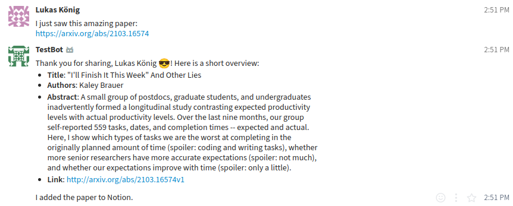
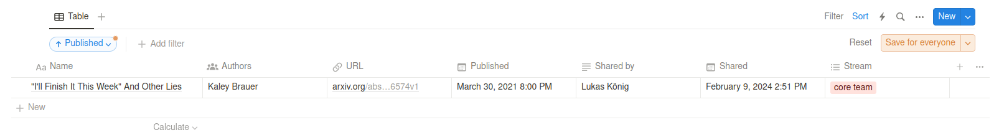

# ZulipNotionPaperBot
Zulip-Notion linking bot that saves papers (currently arxiv & openreview) and their info in a Notion database when their link is posted in Zulip.

↓  

# Setup steps
## 1. Download Repo:
  Download the code of this repository to the machine you want to run the bot from
## 2. Add a new bot on Zulip:
  On Zulip go to the upper right corner to `Settings/Personal settings/Bots` and add a new bot. Choose bot type `Generic`. Add the `BOT EMAIL` as `ZULIP_EMAIL` in the `config.py`, and the `API KEY` under `ZULIP_API_KEY`. You can configure the name and avatar of the bot as you prefer. Then go to the Bot and `Edit bot`, then `Streams`. Now subscribe the bot to all the streams you want it to listen to.
## 3. Add the Zulip site
  Save the URL of the Zulip site you want to use the bot on under `ZULIP_SITE` in the `config.py`
## 4. Add connection to Notion
  Go [here](https://www.notion.so/my-integrations) and add a `new integration`. Add the `Internal Integration Secret` as `NOTION_TOKEN` to the `config.py`.
  Select the workspace of the database you want to link to as the `Associated workspace`.
## 5. Create a database on Notion
  Create a database on Notion which must have the following columns:
  - `Name` having the Type `Title`
  - `URL` having the Type `URL`
  - `Code` having the Type `URL`
  - `Authors` having the Type `Multi-select`
  - `Shared by` having the Type `Multi-select`
  - `Published` having the Type `Date`
  - `Shared`having the Type `Date`
  - `Stream`having the Type `Multi-select`
    
  These can be in random order and additional columns can be added.
  The database id can be found in the url on Notion when being on the database page.
  The url is formatted in the following way `https://www.notion.so/{chars}/{database_id}?v={chars}`. Add the `database id` to the `config.py` as `NOTION_DATABASE_ID`.
## 6. Add the connection to the database
  Click the three dots in the upper right on your database and then under `Add connections` add your new connection.
## 7. Run the bot
  You can run the bot using `python bot.py` from the `src` folder.
  

